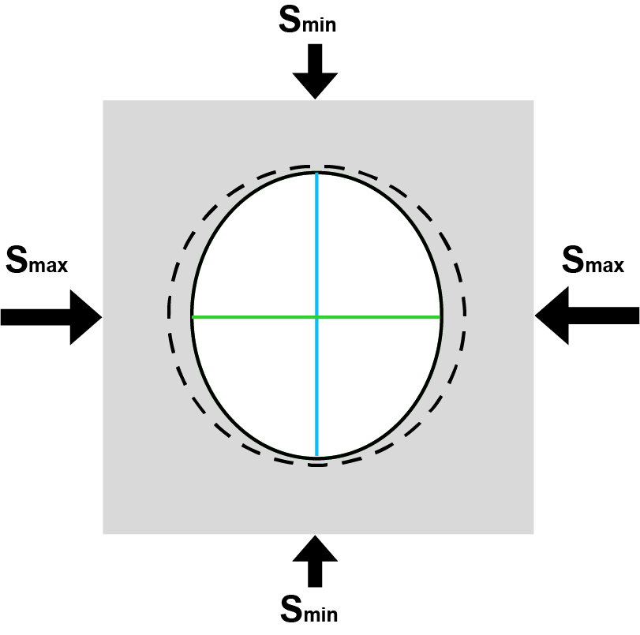
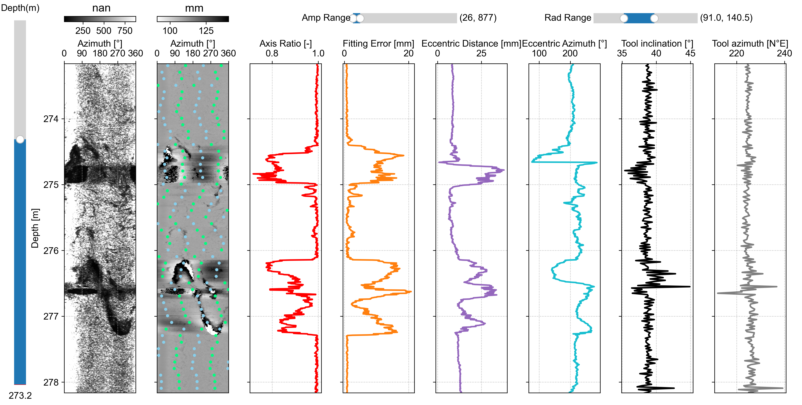
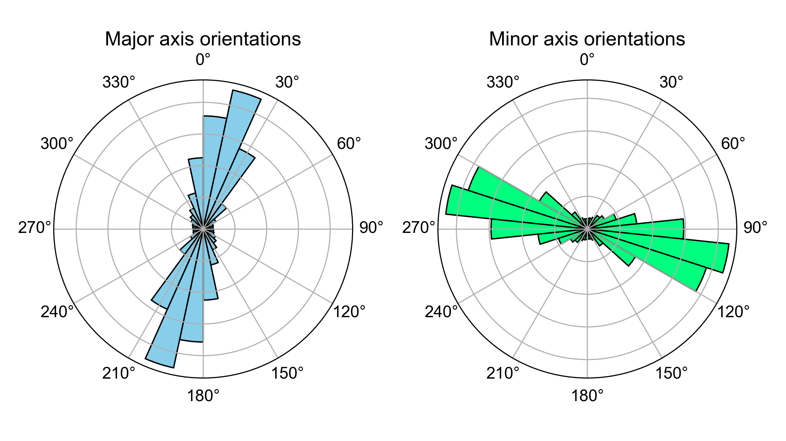

# Welcome to Borehole Ellipticity project

<br>
Borehole Ellipticity project contains codes that can compute borehole (cross-sectional) ellipticity from acoustic televiwer (ATV) logs, and invert in-situ stress states from borehole ellipticity.

The codes are hosted on USTC Geomechanics Group's private cloud server, accessible through [here](http://210.45.127.136:5000/sharing/D8bb5BGxJ).



<br>

## Project layout

    borehole_ellipticity.py  # Compute borehole ellipticity from ATV traveltime log.
    
    stressinv/  # Stress inversion codes.
        stressinv_ellipticity.m  # Invert stress state from borehole ellitpicity (entire borehole)
        stressinv_ellipticity_depthwise.m  # Invert stress states from borehole ellipticity (depth intervals)
        stress_vector_to_strike_dip.m
        compute_aphi.m
        euler_angle_to_stress_vector.m
        RMSE_azimuth.m
        EllipAxisOrien.m
    
    vis/  # Data visualzation codes.
        dispCSV.py  # Display ATV log.
        dispCrossSection.py  # Display borehole cross-sections.
        dispEllip.py  # Display borehole ellipticity parameters.
    
    data/  # Demo data.
        ST1_20210305_DEV_ATV_up_main_TT_NM.csv  # ATV traveltime log.
        ST1_20210305_DEV_ATV_up_main_AMP_NM.csv  # ATV amplitude log.
        ST1_20210305_DEV_ATV_up_main_AZIMUTH.csv  # ATV-measured borehole azimuths.
        ST1_20210305_DEV_ATV_up_main_TILT.csv  # ATV-measured borehole tilt angles.
        ST1_20210305_DEV_ATV_up_main_WNDTIME.csv  # ATV acoustic window traveltime log.
        borehole_ellipticity_outputs/
            ellipticity_parameters.csv  # Borehole ellipticity parameters.
            centralized_traveltime.csv  # Centralized ATV traveltime.
            borehole_radius.csv
            borehole_cross_section_azimuths.csv

    functions.py
    requirement.txt

<br>

## Installation
Prepare a Python environment with Python ≥ 3.10 using conda command:

`conda create -n ellipticity python=3.10`

Download the project from the [cloud server](http://210.45.127.136:5000/sharing/D8bb5BGxJ) to a folder on your local device.

Then enter the folder, and install all the required package using pip command:

`pip install -r requirements.txt`

Finally, activate the environment using conda command:

`conda activate ellipticity`

Now you are all set.

<br>

## Compute borehole ellipticity
For computing borehole ellipticity, you need to open the following Python script:

`borehole_ellipticity.py`

which conducts least-square ellipse fitting to borehole cross-sections derived from the ATV traveltime log.

Then, edit the input section, which has already been configured for demonstration:

```
# ---------------------- Input section ---------------------- #
# File path to the ATV traveltime log.
fp_tt = './data/ST1_20210305_DEV_ATV_up_main_TT_NM.csv'
# File path to the ATV tool's acoustic window traveltime (AWT) log. 
# Optional. Input None if not available.
# The AWT is the two-way traveltime of the acoustic signal within the ATV tool.
fp_wtt = './data/ST1_20210305_DEV_ATV_up_main_WNDTIME.csv'
# When the AWT log is not available, define an AWT value (same unit as the ATV traveltime).
# Optional. Input None if the AWT log is available.
wtt = None
# Radius of the ATV tool's acoustic head (unit: meter).
rp = 0.019  # Reference value for ALT-QL40-ABI.
# Sonic velocity of borehole fluid (unit: m/s).
vf = 1480
# A mutilplier for converting the ATV traveltime's unit to millisecond.
# Input None if not needed.
beta = None
# File path of the ATV traveltime log's mask which will partially exclude the traveltime log from ellipse fitting.
# Optional.
fp_mask = None
# Output directory.
dir_out = './data/borehole_ellipticity_outputs'
# ----------------------------------------------------------- #
```

Then, run the code.

The outputs are stored in `data/borehole_ellipticity_outputs` folder by default. The ellipticity parameters are saved in `ellipse_parameters.csv`:

| Depth | Azimuth_Major | Azimuth_Minor | Diameter_Major | Diameter_Minor | Center_x | Center_y | FittingError|
|-------|---------------|---------------|----------------|----------------|----------|----------|-------------|
| m | deg | deg | mm | mm | mm | mm | mm |
| 213.3626099 |	27.2013076 | 117.2013076 | 218.1290569 | 217.1751262 | -7.505987566 | -9.398823525 |0.618327876|
| 213.3667755 |	37.70659401 | 127.706594 | 218.1568949 | 217.2814357 | -7.510627093 | -9.334088801 |0.594598325|
| 213.3709412 |	37.70659401 | 127.706594 | 218.1568949 | 217.2814357 | -7.510627093 | -9.334088801 |0.594598325|
| ... |	... | ... | ... | ... | ... | ... |...|

Explanation of the parameters:

1. **Depth**: Measured depth along the borehole.
2. **Azimuth_Major**: Major axis azimuth of the ellipse fitted to the borehole cross-section.
3. **Azimuth_Minor**: Minor axis azimuth of the ellipse fitted to the borehole cross-section.
4. **Diameter_Major**: Major axis diameter of the ellipse fitted to the borehole cross-section.
5. **Diameter_Minor**: Minor axis diameter of the ellipse fitted to the borehole cross-section.
6. **Center_x**: ATV tool center's x-coordinate relative to the center of the borehole.
7. **Center_y**: ATV tool center's y-coordinate relative to the center of the borehole.
8. **FittingError**: Fitting error between the ellipse and borehole cross-section.

Some by-products are also saved to the output folder:

1. `centralized_traveltime.csv`: The centralized ATV traveltime log.
2. `borehole_radius.csv`: Circumferential borehole radius log.
3. `borehole_cross_section_azimuths.csv`: Corrected azimuth of the ATV traveltime log.

<br>

## Display borehole ellipticity

There are two ways to display borehole ellipticity: either displaying ellipticity parameters over the measured depth or on borehole cross-sections.

### Display over the measured depth

Open the `vis/dispEllip.py` script, and edit the input section, which has already been configured for demonstration:

```
# ---------------------- Input section ---------------------- #
# File path to ellipticity parameters.
ellip_fpath = '../data/borehole_ellipticity_outputs/ellipticity_parameters.csv'
# Resampling ellipticity parameters over the measured depth using the following dz interval.
# You may input None to skip the resampling (m, or ft, or other length units, depending on the measured depth in the ATV logs). 
dz = 0.1
# File path to the ATV amplitude log.
fp_atvAmp = '../data/ST1_20210305_DEV_ATV_up_main_AMP_NM.csv'
# File path to the borehole radius log.
fp_atvRad = '../data/borehole_ellipticity_outputs/borehole_radius.csv'
# Colormap for the ATV amplitude log.
cmapAmp = 'gray'
# Colormap for the ATV traveltime log.
cmapRad = 'gray_r'
# File path to the ATV-measured borehole inclination.
fp_atvInc = '../data/ST1_20210305_DEV_ATV_up_main_TILT.csv'
# Fila path to the ATV-measured borehole azimuth.
fp_atvAzi = '../data/ST1_20210305_DEV_ATV_up_main_AZIMUTH.csv'
# Length for display (m, or ft, or other length units, depending on the measured depth in the ATV logs).
lenZ = 5
# ----------------------------------------------------------- #
```

Then, run the code.

It will pop up two windows. 

One is a multi-column figure of the ellipticity parameters, ATV logs, and ATV-measured borehole inclination and azimuth:



The other window contains two rose diagrams showing the orientations of ellipse major and minor axis azimuths, respectively:



